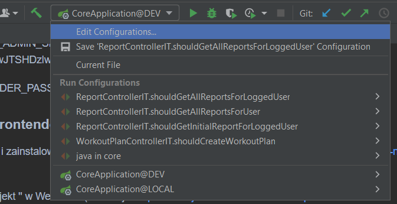
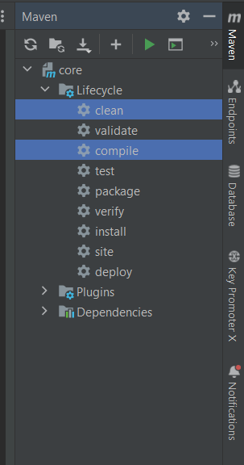

# TrainMate

## Instalacja

### Baza danych

Należy zainstalować PostgreSQL. Instrukcja : https://www.postgresqltutorial.com/postgresql-getting-started/install-postgresql/

Podczas instalacji zaznaczamy opcję instalacji narzędzia PgAdmin.
Podane podczas instalacji hasło i port zapisujemy - przyda się w następnych etapach.

Gdy instalacja się zakończy, otwieramy narzędzie PgAdmin i tworzymy pustą bazę danych o nazwie 'tm_core' przypisaną do użytkownika 'postgres' zgodnie z
poradnikiem: https://www.tutorialsteacher.com/postgresql/create-database (Create Database using pgAdmin).

### Keycloak

Należy zainstalować Docker Desktop. Instrukcja: https://docs.docker.com/desktop/install/windows-install/

Następnie trzeba zaimportować obraz dockerowy dołączony na płycie. Aby to zrobić trzeba otworzyć wiersz poleceń w lokalizacji gdzie znajduje się obraz
i wykonać następującą komendę. 'docker import .\latest.tar keycloak:23.0.3'

### Aplikacja backendowa

Należy zainstalować
IDE: https://lp.jetbrains.com/intellij-idea-features-promo/?source=google&medium=cpc&campaign=EMEA_en_PL_IDEA_Branded&term=intellij%20idea&content=693349187715&gad_source=1&gclid=CjwKCAjwydSzBhBOEiwAj0XN4HoNs9wyaPRXfvIWkqq6EN7nZ3JeE6icIGrQ1dQmvUk4Hy9NdhMQDhoC1MIQAvD_BwE

Po otworzeniu projektu '' w IntelliJ IDEA z aplikacją backendową, wchodzimy w plik 'core/src/main/resources/application.yml' i podmieniamy klucze ${} według
następującego schematu:

${POSTGRES_PORT} - port na jakim działa postgres, domyślnie: 5432

${POSTGRES_PASSWORD} - hasło utworzone podczas instalacji PostgreSQL, domyślnie: postgres

${KEYCLOAK_ADMIN_SECRET} - hasło admina z Keycloak, domyślnie: V3ECXZ0cE3wJTSHDzlwkKGYNSAY2XOX0

${EMAIL_SENDER_PASSWORD} - klucz do poczty elektronicznej: fpyqkwncfwziggmr

### Aplikacja frontendowa

Należy pobrac i zainstalować Node.js. Instrukcja: https://docs.npmjs.com/downloading-and-installing-node-js-and-npm

Otwieramy projekt '' w WebStorm(
instalacja: https://www.jetbrains.com/webstorm/promo/?source=google&medium=cpc&campaign=EMEA_en_PL_WebStorm_Branded&term=webstorm&content=523713720429&gad_source=1&gclid=CjwKCAjwydSzBhBOEiwAj0XN4ERxOUY2J8x4OU2umPsyBegmMVa0CTuiZ-_NEzN-ONeBBHbGxZYBIhoCHzAQAvD_BwE).
Następnie w konsoli wpisujemy komendę: 'npm install'.

### Aplikacja Mobilna

Nalezy pobrać IDE: https://developer.android.com/studio?hl=pl

Nastepnie przy pomocy tego IDE otworzyć projekt '', następnie kliknąć 'Sync Now' u góry ekranu, aby pobrać wymagane biblioteki.

## Uruchomienie

### Keycloak

Otwieramy wiersz poleceń i wpisujemy nastepującą komendę:

'docker run -p 8123:8080 keycloak:23.0.3 /opt/keycloak/bin/kc.sh start-dev'

### Backend

U góry ekranu  rozwijamy listę, i klikamy 'Edit Configurations'

Tworzymy konfigurację dla aplikacji Springowej, a jako aktywny profil ('active profiles') wpisujemy 'dev'.

Projekt należy uruchomić korzystając z SKD Java 11.

Nastepnie rozwijamy menu boczne 'Maven', i klikamy dwukrotnie na opcję 'cleac' a następnie na 'compile'

Po wykonaniu powyższych instrukcji uruchamiamy projekt klikając w zieloną strzałkę u góry ekranu.

### Frontend

W konsoli IDE wpisujemy komendę: 'ng serve'.
Aplikacja zostaje uruchomiona pod linkiem 'localhost:4200'

Po wejściu na ten link możemy korzystać z aplikacji.

### Aplikacja mobilna

Po kliknięciu na zieloną strzałkę u góry ekranu otwiera nam się emulator po boku i włącza się apliakcja TrainMate.

## Predefiniowane konta

Aby ułatwić korzystanie z aplikacji, zostały stworzone predefiniowane konta użytkowników,
wraz z początkowym zestawem danych (plany treningowe, baza ćwiczeń, raporty). Początkowy zestaw danych służy do testowania i może zawierać niepoprawne dane.

Login i hasło dla konta trenera personalnego:

### Login: tm-dev
### Hasło: tm-dev

Login i hasło dla konta podopiecznego (Jan Kowalski)

### Login: mentee1
### Hasło: test

Login i hasło dla konta podopiecznego (Adam Nowak)

### Login: mentee2
### Hasło: test

Login i hasło dla konta podopiecznego (Ewa Wiśniewska)

### Login: mentee3
### Hasło: test